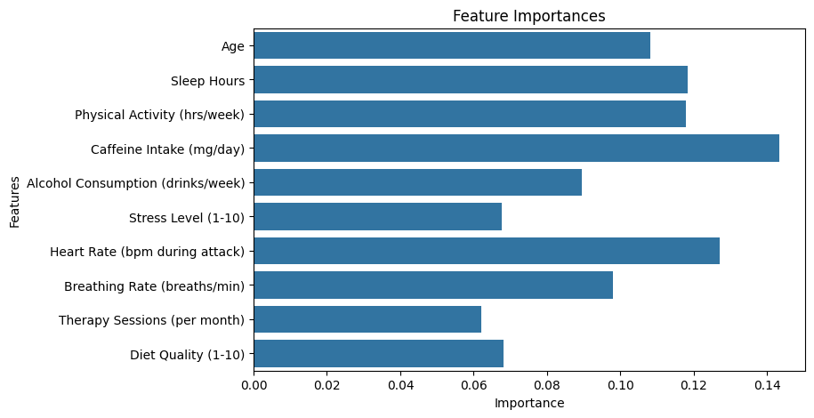
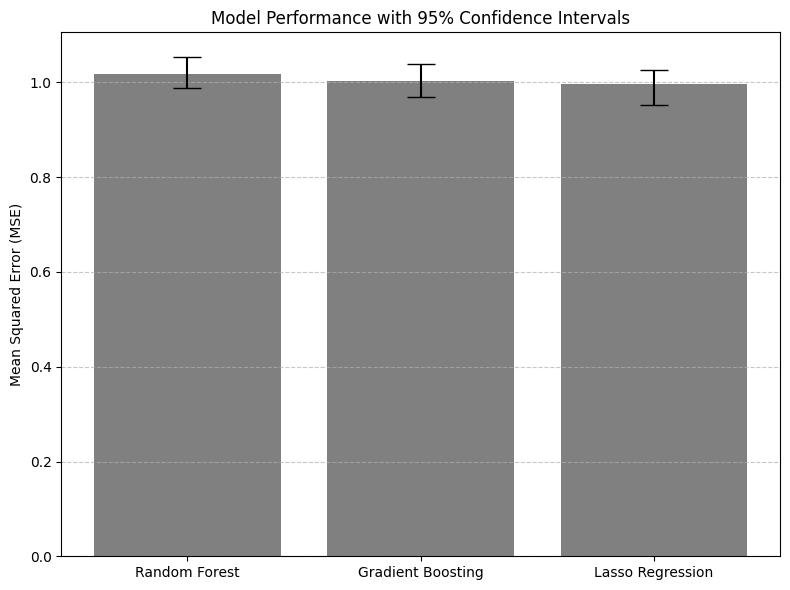

# Anxiety Attack Severity Prediction
- Author: Zeynab Fall
- DSC-4990-02: Data Science Project (Spring 2025) @ Belmont University

## Table of Contents
- [About the Project](#about-the-project)
- [Dataset Description](#dataset-description)
- [Preprocessing](#preprocessing)
- [Feature Selection](#feature-selection)
- [Analysis of Advanced Topics](#analysis-of-advanced-topics)
- [Model Evaluation](#model-evaluation)
- [Conclusion](#conclusion)
- [Dependencies](#dependencies)
- [About the Author](#about-the-author)

## About the Project

Predicting the severity of anxiety attacks using machine learning models (Gradient Boosting, Random Forest, Lasso Regression) based on psychological, health, and lifestyle factors. This project applies data science techniques to mental health research to help understand potential predictors of anxiety attack severity. The goal of this project is to explore how well machine learning models can predict complex psychological outcomes and to identify which factors most strongly contribute to the severity of anxiety attacks.

## Dataset Description

The dataset used for this project contains 12,000 records with 19 features related to psychological, health, and lifestyle factors. Each record represents information about an individual. 

The target variable is **Severity of Anxiety Attack (1-10)**, which the models aim to predict.

**Variables Include:**
- Age
- Gender
- Occupation
- Sleep Hours
- Physical Activity (hrs/week)
- Caffeine Intake (mg/day)
- Alcohol Consumption (drinks/week)
- Smoking Status
- Family History of Anxiety
- Stress Level (1-10)
- Heart Rate (bpm during attack)
- Breathing Rate (breaths/min)
- Sweating Level (1-5)
- Dizziness
- Medication Use
- Therapy Sessions (per month)
- Recent Major Life Event
- Diet Quality (1-10)
- Severity of Anxiety Attack (1-10) 

## Preprocessing

Preprocessing steps were applied to prepare the dataset before training the machine learning models:

- **Label Encoding:**  
Categorical features such as Gender, Occupation, Smoking Status, Family History of Anxiety, Dizziness, Medication Use, Therapy Sessions, and Recent Major Life Events were label encoded into numerical values so they could be interpreted.

- **Standardization:**  
All numeric columns were standardized using z-score normalization. This process scaled the features to have a mean of 0 and a standard deviation of 1, making sure that no single feature dominated the model training process.

- **Dropping Column:**  
The ID column was dropped because it did not provide meaningful information for prediction.

These preprocessing steps were taken to make sure that the models could be effective in learning patterns from the data without being biased by categorical formats or inconsistent feature scales.

## Feature Selection

To improve model performance and reduce noise, a backward selection technique was used for feature selection. A Random Forest Regressor was used as the base estimator inside RFE. The top 10 most important features were selected for model training. 

Features Selected:

- Heart Rate (bpm during attack)
- Breathing Rate (breaths/min)
- Sleep Hours
- Caffeine Intake (mg/day)
- Physical Activity (hrs/week)
- Stress Level (1-10)
- Alcohol Consumption (drinks/week)
- Diet Quality (1-10)
- Age
- Therapy Sessions (per month)

## Analysis of Advanced Topics

This project addresses five advanced topics, adding up to 4 points for grading:

### Gradient Boosting (1 point)

In this project, a Gradient Boosting Regressor was trained using the selected features. Gradient Boosting was chosen because it is an ensemble learning technique that builds models sequentially, where each new model attempts to correct the errors made by the previous ones. The model was evaluated on the test set:
- **Mean Squared Error (MSE):** 1.004
- **R-Squared (R²) Score:** -0.010

The results indicate that while Gradient Boosting handled the data patterns moderately well, predicting the exact severity of anxiety attacks remains challenging due to the complexity of psychological factors.

### Random Forest (1 point)

In this project, Random Forest was used for both feature selection (inside RFE) and for final modeling. I chose Random Forest because it is an ensemble method that creates multiple decision trees and averages their results to improve prediction and reduce overfitting. The Random Forest model achieved:
- **Mean Squared Error (MSE):** 1.019
- **R-Squared (R²) Score:** -0.025

Random Forest also provided feature importance scores, which were visualized in a bar plot to show which features contributed most to prediction.  

### Lasso Regression (1 point)

Lasso Regression introduces regularization by applying a penalty that forces some feature coefficients to shrink toward zero. In this project, Lasso Regression was trained on the selected features and evaluated on the test set, achieving:  

- **Mean Squared Error (MSE):** 0.996
- **R-Squared (R²) Score:** -0.002

Lasso helps to prevent overfitting and reduces the influence of less important variables, however, in this dataset its performance was similar to the other models.

### Feature Selection (0.5 points)

Feature Selection was performed using Recursive Feature Elimination (RFE) with a Random Forest Regressor as the estimator. RFE recursively removed the least important features until the top 10 features were selected.  
The selected features included Heart Rate, Breathing Rate, Sleep Hours, Caffeine Intake, Physical Activity, Stress Level, Alcohol Consumption, Diet Quality, Age, and Therapy Sessions.

These results were visualized through a feature importance plot, helping to highlight the factors that most strongly influenced anxiety attack severity.

### Error Analysis - Confidence Intervals (0.5 points)

To assess the strength of the models, bootstrapping was applied to generate 95% confidence intervals for the Mean Squared Error (MSE).  
The results showed the following ranges:
- **Random Forest:** 0.988 – 1.053
- **Gradient Boosting:** 0.970 – 1.039
- **Lasso Regression:** 0.952 – 1.025

These intervals were visualized using a bar plot below with error bars, helping to show the average model performance and the variability across resampled test sets.

## Model Evaluation

After training and evaluating the models, all three (Random Forest, Gradient Boosting, and Lasso Regression) produced similar Mean Squared Error (MSE) values around 1.0 and negative R² scores.

- Lasso Regression had the lowest MSE (0.996) but also a negative R² (-0.002), suggesting limited predictive power.
- Gradient Boosting and Random Forest performed similarly, with MSEs of 1.004 and 1.019.

Bootstrapped 95% confidence intervals for MSE were also calculated to assess model reliability:
- Random Forest: 0.988 – 1.053
- Gradient Boosting: 0.970 – 1.039
- Lasso Regression: 0.952 – 1.025

The overlapping confidence intervals suggest that there was no statistically significant difference in performance between the models. This shows the difficulty of accurately predicting the severity of anxiety attacks based only on demographic, lifestyle, and physiological factors.

## Conclusion

This project explored the use of machine learning techniques to predict the severity of anxiety attacks based on psychological, health, and lifestyle factors. Gradient Boosting, Random Forest, and Lasso Regression models were trained and evaluated. The models achieved similar Mean Squared Error (MSE) values around 1.0, and slightly negative R² scores, indicating limited predictive accuracy. Feature selection helped focus on the most predictive features, such as Heart Rate, Breathing Rate, and Sleep Hours. Error analysis using bootstrap confidence intervals further demonstrated that the models' performances were statistically similar. 

The results demonstate the difficulty of modeling mental health outcomes, where complex human experiences and emotions are influenced by many unmeasured factors that go way beyond the available data. Overall, this project showed that while machine learning can capture some important patterns, predicting the severity of anxiety attacks remains a highly complex task that may require richer datasets, clinical assessments, and psychological evaluations for higher predictive success.

### Recommendations for Future Work

- **Explore more advanced feature interactions** and test complex models (such as deep learning or ensemble stacking) to capture non-linear relationships.
- **Collaborate with mental health professionals** to identify features that are clinically meaningful and not just statistically significant.
- **Expand the dataset** by including a more diverse range of demographics to reduce potential biases.
- **Investigate targeted interventions** that could help reduce the severity of anxiety attacks once high-risk individuals are identified.
- **Refine feature selection** by further analyzing which predictors (such as physiological measures like heart rate) consistently contribute to prediction, while recognizing that features like occupation and gender contributed very little predictive value.

The findings from this project reflect the challenges of predicting mental health outcomes but also prove the important starting points for future research combining psychology and data science.

## Dependencies

The following Python libraries were used in this project:

- pandas
- numpy
- matplotlib
- seaborn
- scikit-learn

  ## About the Author

I am Zeynab Fall. I am a senior at Belmont University majoring in Psychological Science and Data Science, graduating in May 2025. My academic focus is on applying data science techniques to better understand psychological outcomes. This project is part of my capstone work for DSC-4990: Data Science Project.  

As I continue building my portfolio, I plan to add more projects that explore the intersection of psychology, health, and data analytics. This Anxiety Attack Severity Prediction project represents my first public project combining my interests in mental health and data science.
